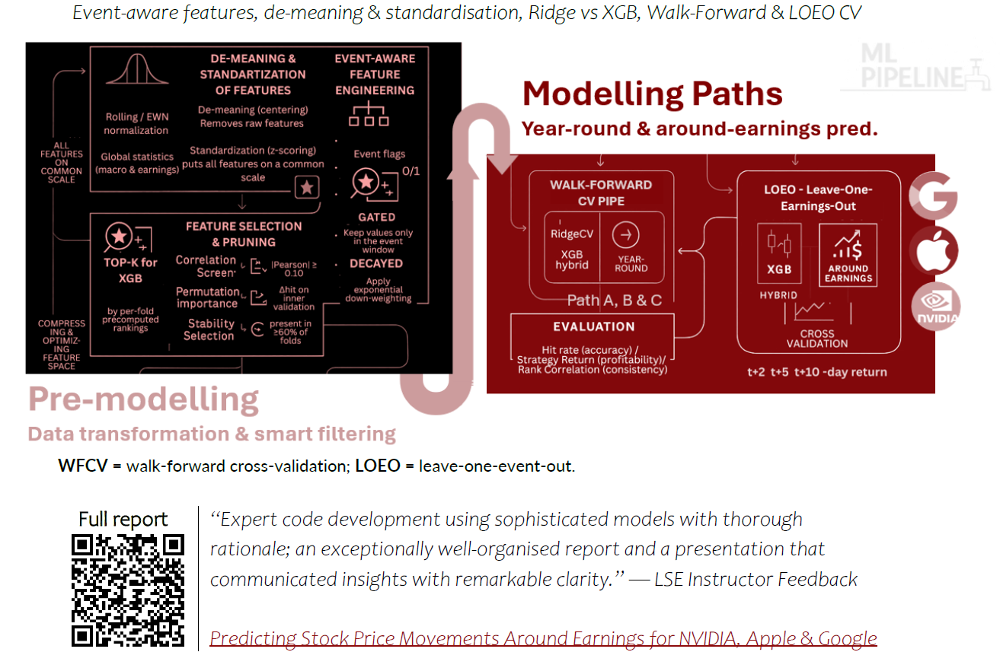
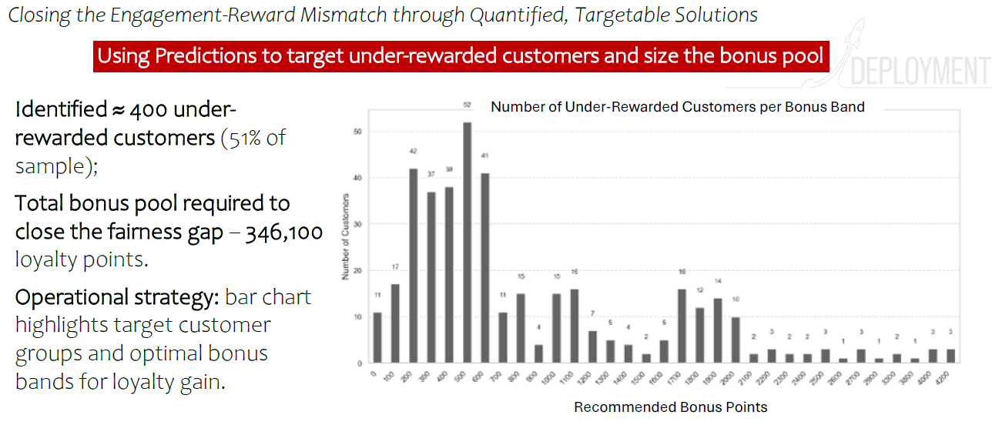
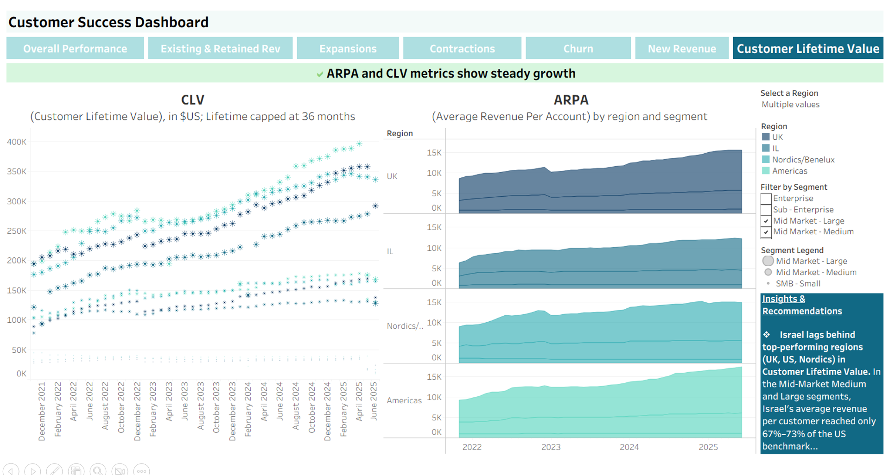
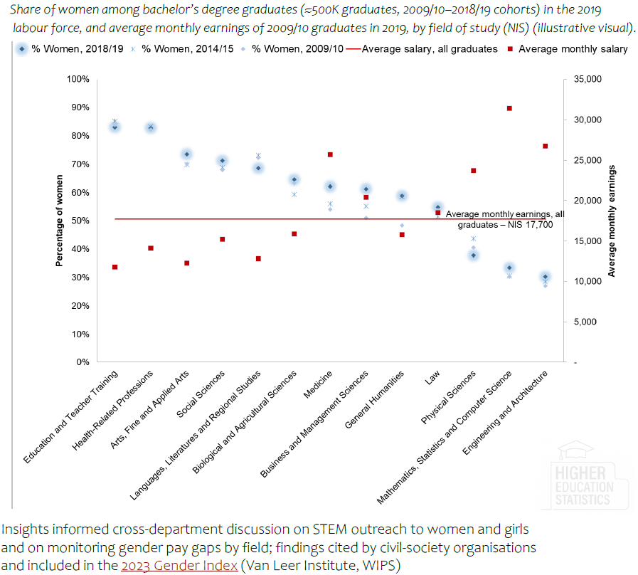
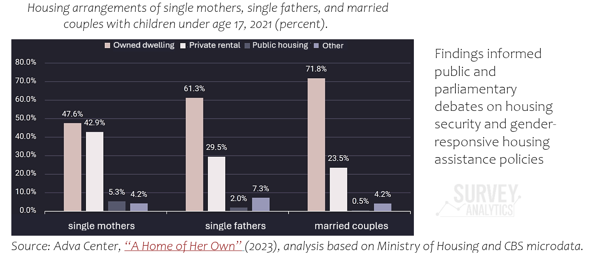
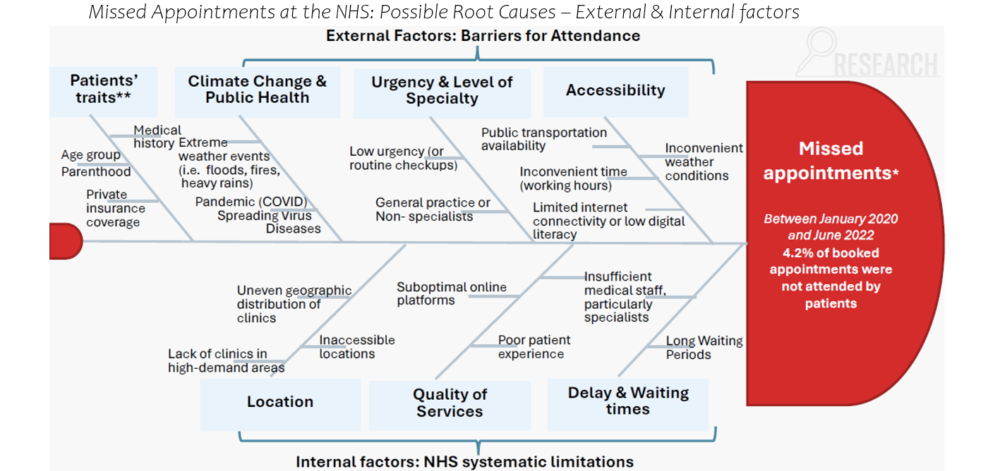
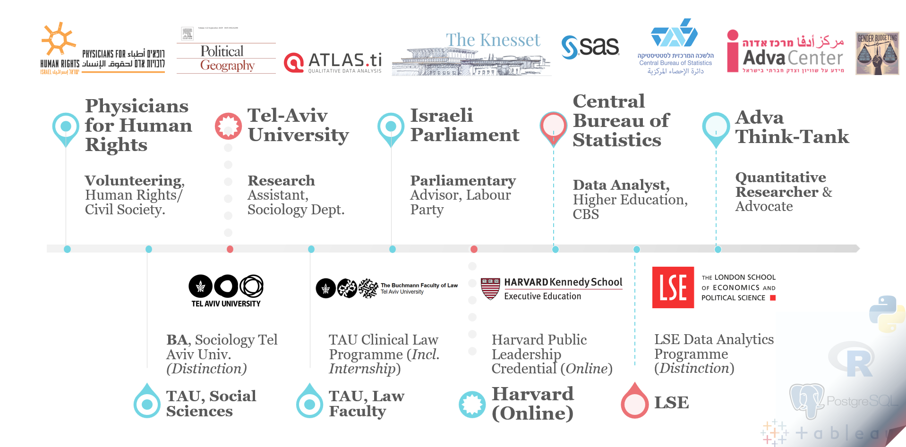

<h2 align="center">Tehila Sharabi — Data Analyst & Researcher</h2>

  Python • SQL • R • SAS • Tableau | LSE Data Analytics Graduate

  Solving complex problems with advanced analytics, robust methodologies, and impactful recommendations. 

  <a href="mailto:sharabitehila@gmail.com">Email</a> •
  <a href="https://www.linkedin.com/in/tehilasharabi/">LinkedIn</a> •
  <a href="https://github.com/Tehila87?tab=repositories">Repos</a>

<strong> Open to roles in London (visa sponsorship welcome)</strong>

### Profile
#### Creative, rigorous and impact-driven data analyst with 6 years’ experience across higher education, the public sector and research organisations. Skilled in analysing large-scale survey and administrative datasets, sourcing financial and macro-economic data (scraping, APIs), and building statistical and machine-learning pipelines (regression, classification, clustering, XGBoost). Proficient in Python, SQL, R, SAS and Tableau. Prioritises robust methodologies, data quality, clear documentation and reproducible workflows. Recent LSE Data Analytics graduate (Distinction). Brings strong transferable skills, including cross-sector partnership building, rich stakeholder engagement, and work in fast-changing, high-stakes environments (including initiating ~10 parliamentary debates and 10+ committee presentations as a think-tank advocate and researcher). Passionate about bridging data science and action.
---

### ⭐ Data science skills demonstrated via selected project excerpts

## 🔧 1. Predictive & ML Pipelines
Event-aware, reproducible modelling for business use.
- **Stock Prices Prediction Pipeline** — event-aware features; Ridge/XGBoost; LOEO & walk-forward validation; 
  ➜ **Repo:** https://github.com/Tehila87/stock-prices-prediction-pipeline
- **Customer Loyalty (R & Python)** — MLR + tree model to identify under-rewarded customers and size the bonus pool; segment performance & fairness checks. *(link coming)*
  

  

<small>
  
<strong> What this shows: </strong>

> Advanced data handling and model design methods:feature de-meaning/standardisation, event-aware engineering, stability/top-k selection  
> Two modelling paths: Walk-Forward CV (year-round) and LOEO (around-earnings) with Ridge/XGBoost 
> Emphasis on reproducible pipelines and clean documentation. 
> LSE instructor feedback
</small>

---
## 🧭 2. Deployment & Actionable Analytics
From predictive insights to business strategies

- **Targeting under-rewarded customers** — used model outputs to quantify the gap (≈51% of sample) and calculate a bonus pool (346,100 loyalty points).
  

    
  </a>

---
## 📈 3. BI / Dashboards / Stakeholder Reporting / Strategic Recommendations
KPIs, narrative-ready outputs, and decision support.

- **Customer Success Tableau dashboard** — tracks key Customer Success KPIs (MRR, NRR, upsell/expansion, renewal, new ARR, logo churn, CLV, ARPA) with segment filters and a built-in insights/recommendations panel for decisions.
  

    

- **Graduate Outcomes dashboard design (GOS sample data)** — built to present key Graduate Outcomes metrics (diversity, unemployment, YoY trends, ethnic/gender differences) through clear visuals and takeaways for decision-makers. *(available on request)* 

- **NHS Missed Appointments** — descriptive analytics of drivers & actions (report + deck). *(link coming)*
  

  

<small>

<strong> What this shows: </strong>

> Time-series exploration with annotated shocks (lockdowns/Omicron) 
> Root-cause reasoning → actionable recommendations (capacity, prevention, telehealth, agility) 
> Evidence storytelling & stakeholder-ready communication
</small>

## 🏛 4. Public Policy & Inequality Analytics (Past Career)
Statistical work that fed into public / parliamentary conversations.

- **Graduate Outcomes** — linking students to tax records; earnings by field of study and gender.
  

   

- **Gender inequality in housing** — survey analytics; findings informed public and parliamentary debates on housing security and gender-responsive housing assistance policies
 

   

## 🧪 5. Research Scoping & Design
- **LSE Coursework** — problem-framing diagrams, changing contexts (e.g. NHS project).
  

   

---

### 🛠️ Skills
- **Technical:** Python, SQL, R, SAS, scikit-learn, XGBoost, pandas, matplotlib, Tableau  
- **Upskilling:** ML, forecasting & reproducible pipelines  
- **Research:** strong quantitative and qualitative methods  
- **Agility:** adept at closing domain-knowledge gaps and expanding methodologies to meet fast-changing business needs  
- **Teamwork:** contributes innovative ideas, drives forward-thinking initiatives, supports ambitious teammates  
- **Reflective mindset:** committed to continuous improvement

---

### 🎓 Education
- **LSE** — Data Analytics Career Accelerator (Distinction)  
- **TAU** — B.A. Sociology & Gender, minor in Law (magna cum laude)

---

### 💼 Experience snapshots
- Researcher & Policy Advocate (independent think tank) | Data Analyst (Central Bureau of Statistics) | Parliamentary Advisor (Israeli Parliament)
  

   

---
 Planning relocation to London; open to conversations and collaborations around survey-based analytics, advanced predictive modelling, and demand forecasting.
