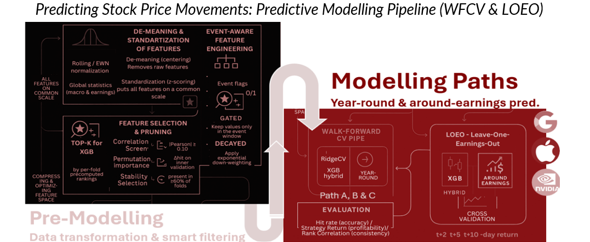
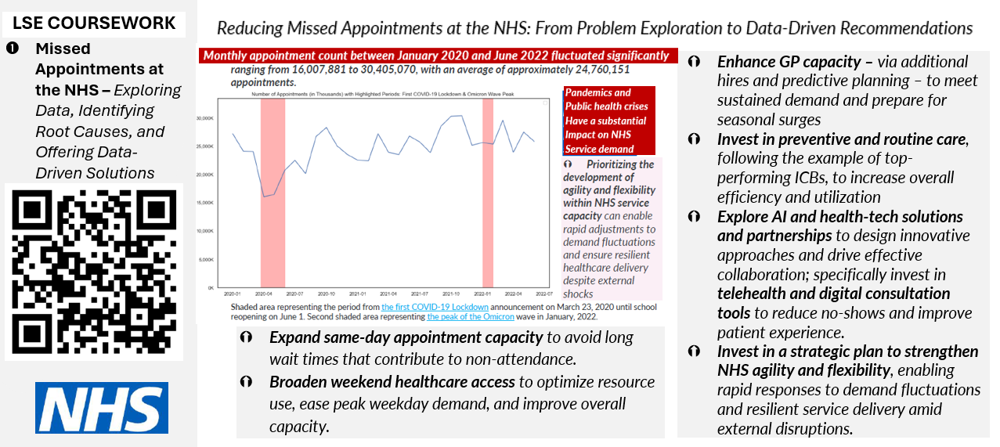

  

<!-- Hero -->
<h2 align="center">Tehila Sharabi — Data Analyst & Researcher</h2>

  Python • SQL • R • SAS • Tableau | LSE Data Analytics Graduate

  Solving complex problems with advanced analytics & modelling, robust methodologies, insightful visuals, and decision-ready recommendations. 

  <a href="mailto:sharabitehila@gmail.com">Email</a> •
  <a href="https://www.linkedin.com/in/tehilasharabi/">LinkedIn</a> •
  <a href="https://github.com/Tehila87?tab=repositories">Repos</a>

### Profile
#### Creative, collaborative, and impact-driven analyst with 6 years’ experience across academia, non-profit, and public sectors. Skilled in advanced quantitative methods and decision-support for stakeholders. Track record includes initiating 10 parliamentary debates and 10+ committee appearances as a think-tank advocate. Currently deepening expertise in data governance, ethical AI, risk-aware modelling, and scalable analytics pipelines.
---

### ⭐ Portfolio highlights
- **Stock Prices Prediction Pipeline** — event-aware features; Ridge/XGBoost; LOEO & walk-forward validation; sample data for a quick run.  
  ➜ **Repo:** https://github.com/Tehila87/stock-prices-prediction-pipeline
- **NHS Missed Appointments** — descriptive analytics of drivers & actions (report + deck). *(link coming)*
- **Customer Loyalty (R & Python)** — MLR + decision tree; segment performance & fairness checks. *(link coming)*

<!-- Portfolio visuals (compact, clickable) -->

  
<strong> Modeling pipeline diagram </strong>

  

  

  
<strong>What this shows (30s)</strong>

  • Feature de-meaning/standardisation, event-aware engineering, stability/top-k selection 
  • Two paths: Walk-Forward CV (year-round) and LOEO (around-earnings) with Ridge/XGBoost 
  • Emphasis on reproducible pipelines and evaluation design

  

  
<strong>What this shows (30s)</strong>

  • Time-series exploration with annotated shocks (lockdowns/Omicron) 
  • Root-cause reasoning → actionable recommendations (capacity, prevention, telehealth, agility) 
  • Evidence storytelling & stakeholder-ready communication

### 🔭 In progress / exploration
- **Graduate Outcomes (UK)** — employability & professional growth using GOS (work in progress). 
- **Demand Forecasting** — event-aware demand forecasting of LEGO representation-linked sets (work in progress).

---

### 🛠️ Skills
- **Technical:** Python, SQL, R, SAS, scikit-learn, XGBoost, pandas, matplotlib, Tableau  
- **Upskilling:** ML, forecasting & reproducible pipelines  
- **Research:** strong quantitative and qualitative methods  
- **Agility:** adept at closing domain-knowledge gaps and expanding methodologies to meet fast-changing business needs  
- **Teamwork:** contributes innovative ideas, drives forward-thinking initiatives, supports ambitious teammates  
- **Reflective mindset:** committed to continuous improvement

### 🎓 Education
- **LSE** — Data Analytics Career Accelerator (certificate)  
- **TAU** — B.A. Sociology & Gender (minor in Law), distinction

### 💼 Experience snapshots
- Researcher & Policy Advocate (independent think tank) | Data Analyst (Central Bureau of Statistics) | Parliamentary Advisor (Knesset)

---

 Planning relocation to London; open to conversations and collaborations around survey-based analytics, advanced predictive modelling, and demand forecasting.
